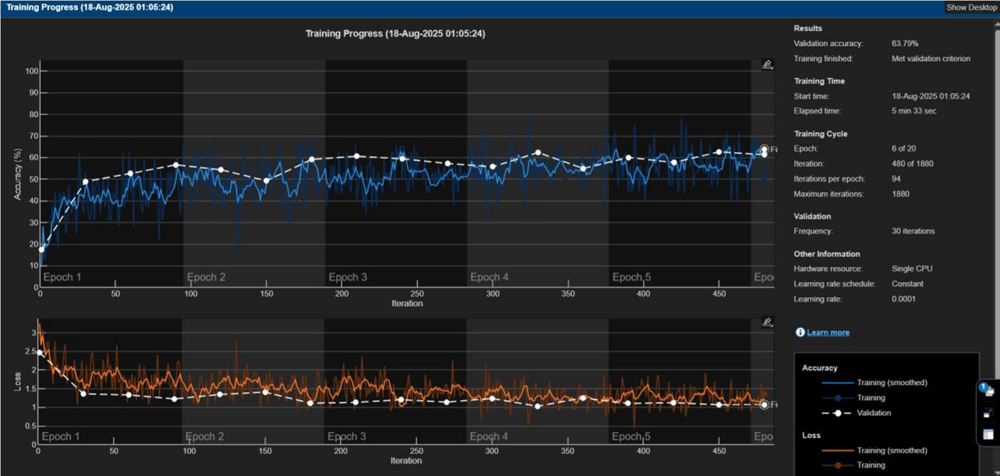
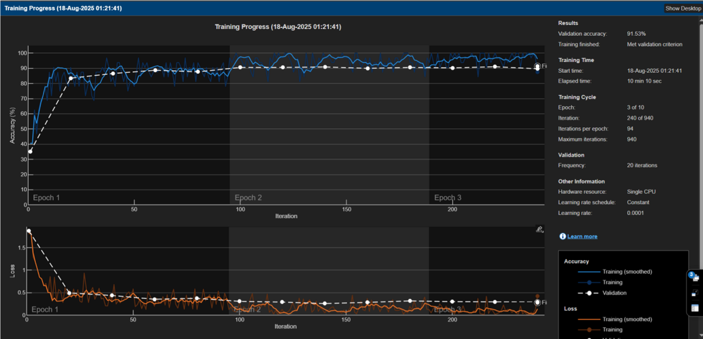
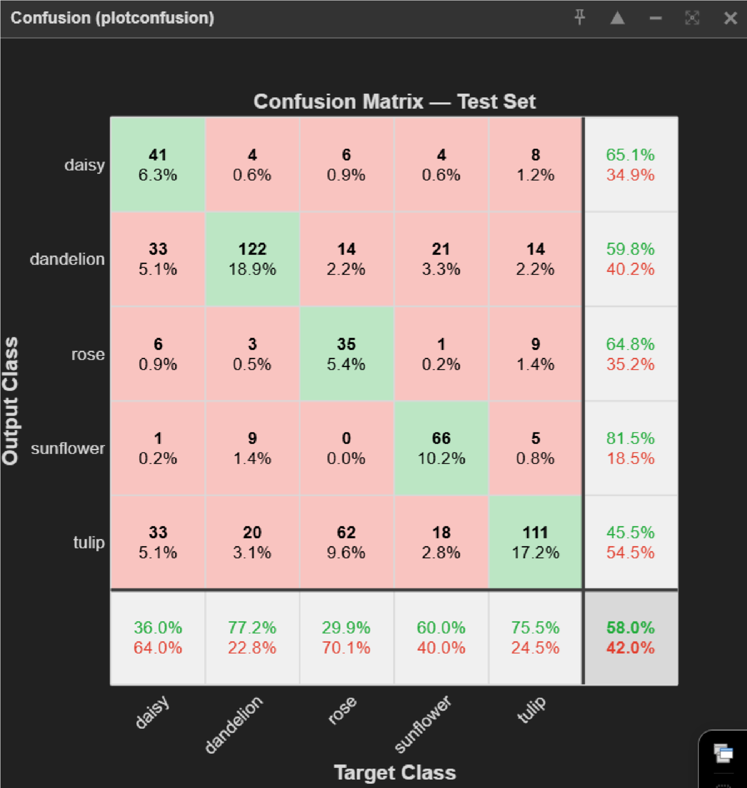
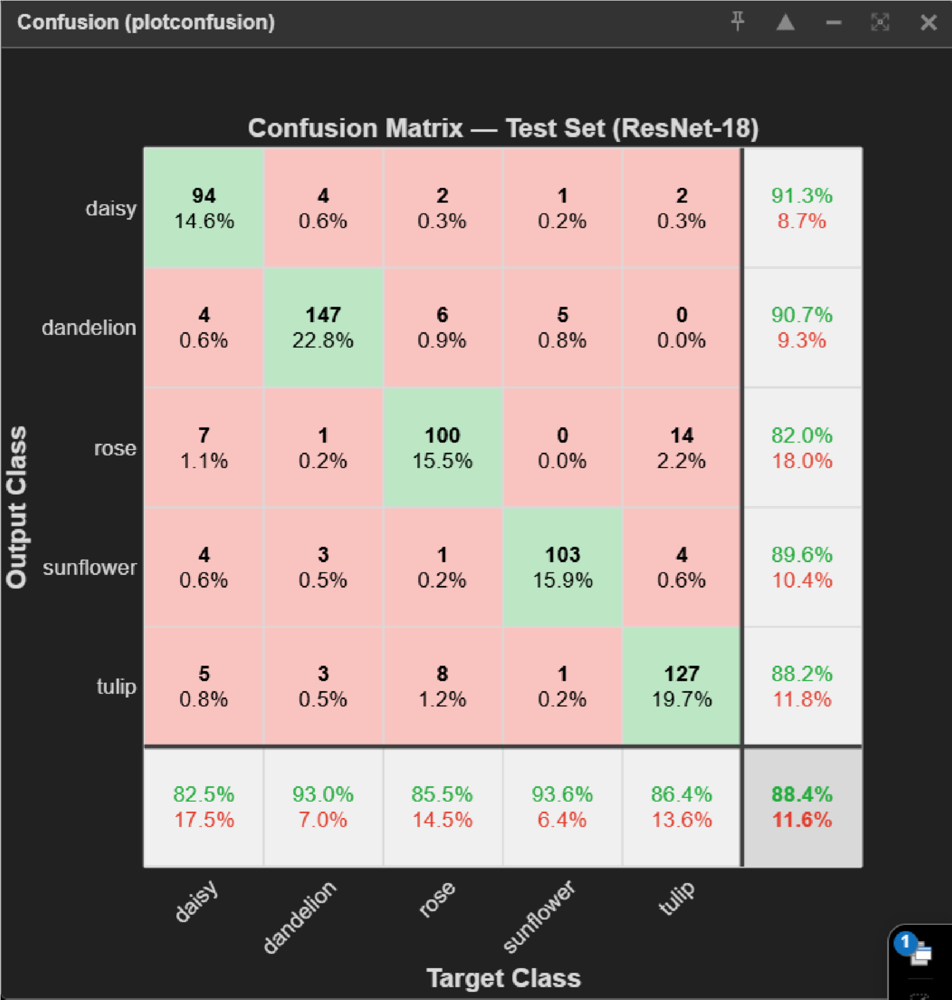

# Flower Recognition — Deep Learning on MATLAB

Image classification of a 5-class flower dataset using a custom CNN and transfer learning with ResNet-18, built in MATLAB.

## Overview
This project investigates whether transfer learning with a pretrained network can outperform a CNN trained from scratch on a moderately sized image dataset. A custom CNN was first built and trained from scratch, then compared against a ResNet-18 model fine-tuned via transfer learning. The transfer learning approach substantially outperformed the from-scratch model, achieving **91% test accuracy** against a target of 80%.

## Tech Stack
- **Language:** MATLAB
- **Toolboxes:** Deep Learning Toolbox, Deep Learning Toolbox Model for ResNet-18
- **Key functions:** `imageDatastore`, `augmentedImageDatastore`, `resnet18`, `trainNetwork`

## Dataset
- 4,300 flower images across 5 classes (~700–900 images per class)
- Source: [Flowers Recognition dataset (Kaggle)](https://www.kaggle.com/datasets/alxmamaev/flowers-recognition/data)
- Split: 70% train / 15% validation / 15% test

## Method
1. **Dataset cleanup** — checked for broken/unreadable files using `imfinfo`
2. **Preprocessing** — baseline CNN resizes images to 128×128×3; ResNet-18 model resizes to match its required input (224×224×3). Both use `augmentedImageDatastore` for on-the-fly augmentation (random rotation ±20°, horizontal reflection, small translations) to reduce overfitting
3. **Baseline model** (`src/flower_cnn_baseline.m`) — a custom CNN (3 convolutional blocks with batch norm + ReLU + max pooling, dropout, fully connected), trained from scratch
4. **Transfer learning model** (`src/flower_resnet18_transfer.m`) — ResNet-18 pretrained on ImageNet, with the final layers (`fc1000`, `prob`, `ClassificationLayer_predictions`) replaced with a new fully connected layer (5 outputs), softmax, and classification layer
5. **Training** — Adam optimizer, learning rate 1e-4, mini-batch size 32; baseline CNN trained up to 20 epochs, ResNet-18 up to 10 epochs, both with early stopping on validation performance

## Results

| Model | Test Accuracy |
|---|---|
| Custom CNN (from scratch) | 63% |
| ResNet-18 (transfer learning) | **91%** |

- Training/validation accuracy converged by ~epoch 8, with validation tracking training accuracy closely — indicating overfitting was well controlled
- Confusion matrix showed balanced performance across all 5 classes, with occasional misclassification between visually similar flower species

**Accuracy curves**

CNN | ResNet-18
:---:|:---:
 | 

**Confusion matrices**

CNN | ResNet-18
:---:|:---:
 | 

## Key Takeaways
- Transfer learning is highly effective for image classification on small-to-medium datasets
- Data augmentation played a significant role in preventing overfitting given the moderate dataset size
- Further gains are possible via deeper architectures (e.g. ResNet-50), fine-tuning intermediate layers, or a larger dataset

## How to Run
1. Download the dataset from the [Kaggle link above](https://www.kaggle.com/datasets/alxmamaev/flowers-recognition/data) and place it in `data/flowers/` (one subfolder per class — this matches what `imageDatastore` expects). The `data/` folder is git-ignored, so you'll need to add the dataset yourself.
2. Open MATLAB with the **Deep Learning Toolbox** and the **Deep Learning Toolbox Model for ResNet-18 Network** support package installed.
3. Run `src/flower_cnn_baseline.m` for the baseline CNN, or `src/flower_resnet18_transfer.m` for the transfer learning model.

## Repository Contents
```
├── src/
│   ├── flower_cnn_baseline.m       # Custom CNN trained from scratch
│   └── flower_resnet18_transfer.m  # ResNet-18 transfer learning model
├── report/
│   └── Flower_Recognition_Report.pdf
├── results/                        # Accuracy curves, confusion matrices
└── README.md
```

## References
- Mamaev, A. (2022). *Flowers Recognition* dataset. Kaggle.
- MathWorks. *Deep Learning Toolbox Model for ResNet-18 Network*.
- Uchida et al. (2016). *A Further Step to Perfect Accuracy by Training CNN with Larger Data*.

## Author
Ashar Zeeshan — MSc Artificial Intelligence, University of East London
[LinkedIn](https://www.linkedin.com/in/asharzeeshan/)
